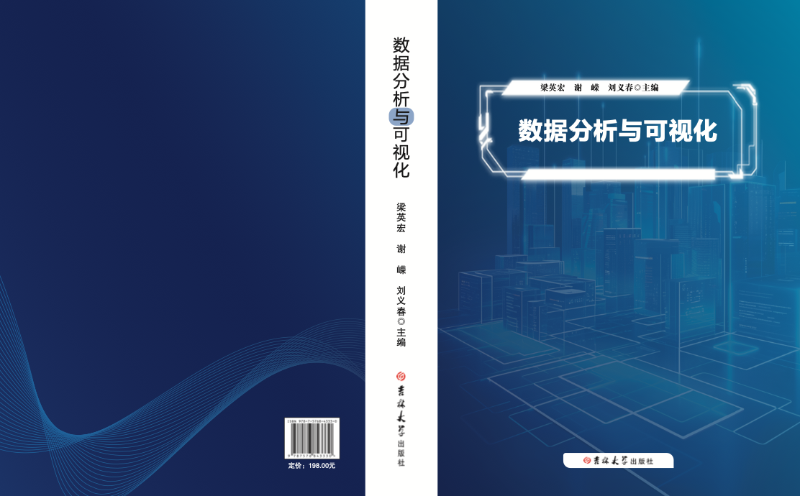

# 数据分析与可视化

### 介绍
在当今信息爆炸的时代，各行各业都在产生和积累海量数据，数据已成为企业和组织最重要的资产之一。如何从海量数据中提取有价值的信息，并将其转化为可行的决策，成为了各行各业面临的共同挑战。通过数据分析，隐藏在数据背后的规律得以被揭示，复杂问题得以解决，从而为决策提供有力支持。而数据可视化作为数据分析的重要组成部分，能够将抽象的数据形象化，使信息更直观、更易于理解。Python语言因其简洁易学、功能强大而成为数据分析以及可视化的首选工具。本书基于Python语言及其生态，详细介绍了如何利用它们高效地进行数据分析和可视化工作。

本书的主要特点如下：
1. 内容全面：本书共分为15章，涵盖了数据分析与可视化的各个重要方面。从基础的NumPy和Pandas库的使用，到高级的机器学习和深度学习算法的应用，再到各种可视化工具的介绍，本书为读者提供了一个完整的知识体系。
2. 实用性强：本书注重理论与实践的结合，每一章都包含大量的代码示例和实际应用案例，帮助读者将所学知识应用到实际问题中。同时每章末尾都有习题，便于读者巩固所学内容。
3. 循序渐进：本书的编排遵循由浅入深的原则。从基础的数据处理工具开始，逐步过渡到更复杂的分析方法和可视化技术。
4. 多种工具介绍：本书不仅介绍了Python数据分析的核心库NumPy和Pandas，还涵盖了多种流行的可视化工具，如Matplotlib、Seaborn、PyEcharts、Plotly等。
5. 前沿技术覆盖：本书在介绍传统数据分析方法的同时，也涵盖了当前热门的机器学习和深度学习技术。

本书共分为十五章，内容涵盖了数据分析与可视化的各个方面：
- 第一章介绍数据分析与可视化的基本概念。
- 第二章至第四章深入讲解NumPy和Pandas这两个Python数据分析的核心库，掌握数据处理、操作和分析的基本技能。
- 第五、第六、第九章重点介绍Matplotlib和Seaborn这两个强大的可视化库，学习如何创建各种类型的图表，将数据以视觉化的方式呈现。
- 第七、第八、第十、第十二章介绍时序分析、科学计算以及机器学习等高级主题。
- 第十一、十三、第十四章介绍PyEcharts、OpenCV、Plotly等其他常用的可视化工具。
- 第十五章结合深度学习技术，介绍数据分析与可视化的前沿发展趋势。

章节目录：
- **第一章 数据分析与可视化介绍**
- **第二章 NumPy数据处理**
- **第三章 Pandas基础**
- **第四章 Pandas高级应用**
- **第五章 Matplotlib可视化**
- 第六章 Matplotlib高级功能与数据可视化应用 \*
- **第七章 时间序列分析与可视化**
- 第八章 高级时序分析方法 \*
- **第九章 Seaborn可视化**
- **第十章 SciPy科学计算与可视化**
- **第十一章 PyEcharts可视化**
- **第十二章 sklearn机器学习与可视化**
- **第十三章 OpenCV可视化技术**
- 第十四章 Plotly可视化 \*
- 第十五章 基于深度学习的数据分析与可视化技术 \*

注意：加\*号表示选学内容。

### 电子版下载

[《数据分析与可视化》,　ISBN 9787576843330](数据分析与可视化_第一版_梁英宏.pdf)，2024年吉林大学出版社出版。纸制版联系lyh@gdufe.edu.cn（邮件），lyhwin_6160027（微信号）。本书配有教师参考，联系方式如前。

### 课程所需软件
1. [ananconda](https://www.anaconda.com/)或[miniconda](https://docs.conda.io/projects/miniconda/en/latest/)，用于使用[jupyter](https://jupyter.org/)交互式笔记本工具，并采用[markdown](https://baike.baidu.com/item/markdown/3245829?fr=ge_ala)语法和[LaTeX](https://www.latex-project.org/)排版工具编辑交互式笔记。
1. 课程中示例以及作业的代码编写测试可在jupyter notebook中完成，亦可使用[VS Code](https://code.visualstudio.com/)、[PyCharm](https://www.jetbrains.com/pycharm/)（ Community Edition）此类集成开发环境编写。
1. 需要安装的Python库包括：numpy、Pandas、Matplotlib、 statsmodels、Prophet、PyFlux、Seaborn、PyeCharts、SKLearn、SciPy、request、cv2、jieba、wordcloud、Plotly、Torch、Torchvision、TorchText等。

### 先修课程
1. python程序设计
1. 需要部分机器学习知识